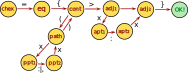

# Glyph parser stuff

## The glyph parser

### Files

The glyphs may reside in various places:

|prio      |Linux                      |Windows                          |notes            |
|----------|---------------------------|---------------------------------|-----------------|
|**prio 1**|the current document       |the current document             |                 |
|**prio 2**|./glyphs.gly               |.\glyphs.gly                     |or .glyphs?      |
|**prio 3**|$(HOME)/.krakfot/glyphs.gly|%HOME%\AppData\Krakfot\glyphs.gly|really this path?|

### The accepted language

**Examples:**

      @41 = {
        (0:0 2:0)
        (6:0 8:0)
        (1:0 4:10.2 7:0)
        (2:3.5 6:3.5)
        >8:0
      }

**Backus–Naur form grammar:**

      <glyphDef>    ::= <glyphSpec> "=" "{"
                           <vertexLists>
                           <adjustment>
                        "}"
      <glyphSpec>   ::= ATHEXNUM
      <vertexLists> ::= <vertexList>
                      | <vertexList> <vertexLists>
      <vertexList>  ::= "(" vertices ")"
      <vertices>    ::= <vertex>
                      | <vertex> <vertices>
      <vertex>      ::= FLOATNUM ":" FLOATNUM   # A real vertex
                      | FLOATNUM "," FLOATNUM   # Control point in a Beziér curve
      <adjustment>  ::= ">" <vertex>

**Scan elements **(*terminals*)**:**

: **ATHEXNUM:** an at-sign `'@'` followed by  a sequence of '0'-'9','A'-'F', 'a'-'f' are invalid digits!

: **FLOATNUM:** a number perhaps starting with '+' or '-', and a sequence of '0'-'9' containing zero or at most one one '.'.

**Wish list:**

1. comments in parser
2. smart error messages: what glyph, what row/column in code file
3. error recovery:
    a. grave errors implies char is closed by scanning to next "}",
    b. lesser errors such as garbage characters are just ignored and bypassed.

### Why?

**Why is the scanner separate from the parser?**
: Becåse (in teory) many parsers should share the same scanner, e.g.

    1. one for definition of letters,
    2. annother for definition of keypresses / commands,
    3. a third for the markup language

### The state machine of the glyph parser

Link: [statemachine.svg](statemachine.svg)

    (init):
        '@x' => (@x)
        others => ERROR!
    (@x):
        '=' => (=)
        (others): ERROR!
    (=):
        '{' => (cont.)
        (others): ERROR!
    (cont.):
        '(' => (path)
        '>' => (adj.₁)
        (others): ERROR!
    (path):
        x => (ppt₁)
        (others): ERROR!
    (ppt₁):
        ':' => (ppt₂)
        (others): ERROR!
    (ppt₂):
        x => (path)
        (others): ERROR!
    (adj.₁):
        x => (apt₁)
        (others): ERROR!
    (apt₁):
        ':' => (apt₂)
        (others): ERROR!
    (apt₂):
        x => (adj.₂)
        (others): ERROR!
    (adj.₂):
        '}' => (OK)
        (others): ERROR!

### Obsolete language

Example:

An 'A':

    begin Char, A;
        begin Strip, left lower serif;
            vertex 0,0;
            vertex 2,0;
        end Strip;
        begin Strip, right lower serif;
            vertex 6,0;
            vertex 8,0;
        end Strip;
        begin Strip, lambda part;
            vertex 1,0;
            vertex 4,10.2;
            vertex 7,0;
        end Strip;
        begin Strip, middle horizontal stroke;
            vertex 2,3.5;
            vertex 6,3.5;
        end Strip;
        translate 8.0, 0;
    end Char;

